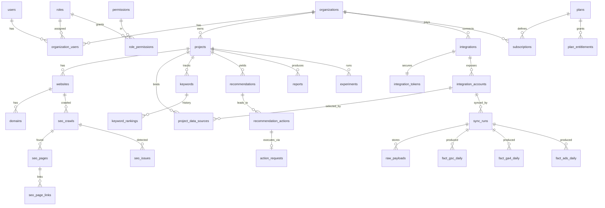

# Marketing Intelligence OS — Production Architecture & Implementation Plan

Status: **PROPOSAL — awaiting approval. No application code has been written.**
Date: 2026-09-29

---

## 0. Findings & decisions needed before coding

### 0.1 The repository is not empty
`sehatora` currently contains **STYLEAI** (Next.js 15 + Prisma + NextAuth, a fashion app) and an 11 MB zip. It is unrelated to this product. I propose **not touching it**. Options:

| Option | Notes |
|---|---|
| **A (recommended)** New top-level directory `marketing-os/` in this repo as a monorepo (`apps/web`, `apps/api`). STYLEAI stays untouched. | Zero risk to existing work; can be split into its own repo later (`git filter-repo`). |
| B | New empty repository for Marketing OS. Cleanest, but I only have access to this one repo in this session. |
| C | Replace STYLEAI. Destructive; not recommended without explicit instruction. |

### 0.2 Stack tension to acknowledge
The spec asks for Next.js **and** Laravel. That is a valid split (Next.js = presentation, Laravel = domain/API/queues), but it means two runtimes, two deploy units, and an API contract that must be kept in sync. I accept this and mitigate with **OpenAPI as the single source of truth** generating TypeScript types (§6.6). If you would rather have a single TypeScript stack (Next.js + Postgres + BullMQ), say so now — that is the one decision that is expensive to reverse.

### 0.3 External-platform lead times (not code, but they gate Phases 2–4)
These are real and can take weeks; start them in parallel with Phase 1:

- **Google OAuth app verification** — Search Console, GA4 and Google Ads scopes are sensitive; production use by external users requires Google's verification review (possibly a security assessment for restricted scopes). Until then, only test users.
- **Google Ads API developer token** — requires an approved token (basic/standard access) via a manager account.
- **Meta Marketing API** — requires a Meta app, Business Verification, and App Review (`ads_read`, etc.).
- **PageSpeed Insights API** — API key; quota-limited.
- **Keyword volume/CPC** — Search Console and GA4 do **not** provide search volume. It needs a paid provider (DataForSEO, Semrush API, Google Ads Keyword Planner via the Ads API). Until one is connected, volume renders **"Unavailable"** as specified.
- Rank tracking by SERP scraping is a ToS/legal risk; only provider APIs or Search Console positions are used.

I will confirm exact scopes/quotas against current official docs at implementation time rather than rely on memory; §11 lists them as "to verify".

---

## 1. System architecture

### 1.1 Data flow (the spec's non-negotiable layering)

```
 External APIs (GSC, GA4, Google Ads, Meta, PSI, Shopify, WP, crawler targets)
        │
        ▼
 Integration Adapters  ── one class per provider, implements ProviderAdapter
        │  (OAuth, rate limiting, retries, pagination, error mapping)
        ▼
 RAW LAYER            raw_payloads (compressed JSON, sync_run_id, retained N days)
        │
        ▼
 NORMALIZATION LAYER  Normalizers → typed, provider-neutral fact tables
        │
        ▼
 ANALYTICS ENGINE     Metric registry + query service (period compare, derived metrics)
        │
        ▼
 RECOMMENDATION ENG.  Rules (deterministic) → Recommendation w/ evidence; AI layer on top
        │
        ▼
 APPLICATION API      /api/v1 — returns MetricEnvelope, never raw provider JSON
        │
        ▼
 FRONTEND             Next.js — renders envelopes; cannot see raw responses
```

Rules enforced structurally, not by convention:
1. Frontend/API resources only accept DTOs built from **normalized** tables. Raw payloads are unreachable from controllers (separate `Raw` namespace, no Eloquent relations exposed).
2. A metric leaves the analytics engine only inside a **MetricEnvelope** (§4.3). No envelope → no number on screen.
3. Every write to a fact table carries `sync_run_id` (lineage).

### 1.2 Runtime topology

```
                    ┌──────────────┐
   Browser ───────▶ │  Next.js     │  SSR/RSC, BFF-less: calls Laravel directly
                    │  (apps/web)  │
                    └──────┬───────┘
                           │ HTTPS, cookie session (Sanctum SPA) / CSRF
                    ┌──────▼───────┐        ┌───────────┐
                    │ Laravel API  │───────▶│ PostgreSQL │ (primary + read replica later)
                    │ (apps/api)   │        └───────────┘
                    └──┬────────┬──┘        ┌───────────┐
                       │        └──────────▶│   Redis    │ cache · queues · locks · rate limits
                       │                    └─────┬─────┘
                ┌──────▼───────┐                  │
                │ Horizon      │◀─────────────────┘
                │ queue workers│── crawl │ sync │ reports │ ai │ mail │ webhooks
                └──────┬───────┘
                       ▼
                Object storage (S3-compatible): report PDFs/exports, crawl HTML snapshots, raw payload archive
                Scheduler (`schedule:work`) — single instance, leader-locked
```

Scaling seams (per §57): web, api, each worker pool, Postgres, Redis, storage scale independently. The crawler is behind a `CrawlerRunner` interface so it can move to a dedicated service (Go/Node + headless browser for Phase "browser audits") without touching the domain.

### 1.3 Key architectural decisions (ADR summary)

| # | Decision | Reason |
|---|---|---|
| ADR-1 | Modular monolith (Laravel), domain modules under `app/Domain/*`, not microservices | Team-size appropriate; seams preserved via interfaces + queues |
| ADR-2 | Shared database, shared schema multi-tenancy with `organization_id` on every tenant row + **Postgres RLS** as defence-in-depth | Cheap to operate; RLS prevents a missed `where` from leaking data |
| ADR-3 | OpenAPI-first contract; TS types + Zod generated from it | Prevents Next↔Laravel drift |
| ADR-4 | Sanctum stateful cookie auth for the web app; scoped API tokens for public API later | Secure cookies + CSRF, no tokens in JS |
| ADR-5 | Time-series in **partitioned fact tables** (monthly range partitions on `date`) | 10k+ orgs × daily rows stays queryable |
| ADR-6 | Deterministic analytics/recommendation rules first; LLM only explains/summarises evidence it is handed | Satisfies "No fake AI"; testable |
| ADR-7 | Sync is idempotent (upsert on natural key + `sync_run_id`) and window-based | Safe retries, backfills, late-arriving data |
| ADR-8 | Envelope encryption for secrets (per-row data key wrapped by KMS/app key) | Rotation without re-encrypting everything |
| ADR-9 | Mutating external systems only through the **Approval workflow** (§10) | Spec §16, §54 |

---

## 2. Repository & folder structure

```
marketing-os/
├── README.md
├── docs/
│   ├── architecture/        # this doc split into ADRs, diagrams
│   ├── database/            # ERD, data dictionary, partitioning, retention
│   ├── api/                 # generated OpenAPI + guides
│   ├── integrations/        # one file per provider (auth, scopes, limits, metrics, sync, errors, token lifecycle)
│   ├── deployment/
│   ├── security/
│   └── development/
├── packages/
│   └── api-contract/        # openapi.yaml → generated types (openapi-typescript) + Zod schemas
├── apps/
│   ├── web/                 # Next.js (App Router, TS strict)
│   │   ├── src/
│   │   │   ├── app/
│   │   │   │   ├── (marketing)/login, register, verify-email, forgot-password, 2fa
│   │   │   │   ├── (app)/[orgSlug]/
│   │   │   │   │   ├── dashboard/ projects/ websites/ seo/ keywords/ content/
│   │   │   │   │   ├── google-ads/ meta-ads/ analytics/ tracking/ gtm/ sgtm/
│   │   │   │   │   ├── ecommerce/ competitors/ strategy/ reports/ experiments/
│   │   │   │   │   ├── recommendations/ integrations/ data-health/ settings/ learning/
│   │   │   │   └── system/health (public, minimal)
│   │   │   ├── components/
│   │   │   │   ├── ui/            # primitives (Radix-based, accessible)
│   │   │   │   ├── data/          # MetricCard, MetricEnvelopeView, DataTable, SourceBadge, EmptyState, LineageDrawer
│   │   │   │   ├── charts/        # thin wrappers over one chart lib
│   │   │   │   └── layout/        # Shell, Sidebar, CommandPalette (Cmd/Ctrl+K)
│   │   │   ├── features/<module>/ # queries, hooks, module components
│   │   │   ├── lib/               # api client (typed), query keys, auth, formatters
│   │   │   └── styles/            # Tailwind tokens (design system)
│   │   └── tests/ (unit: Vitest+RTL, e2e: Playwright)
│   └── api/                 # Laravel 11/12, PHP 8.3, strict_types
│       ├── app/
│       │   ├── Http/
│       │   │   ├── Controllers/Api/V1/…     # thin
│       │   │   ├── Requests/                # FormRequest validation
│       │   │   ├── Resources/               # API Resources (DTO → JSON)
│       │   │   └── Middleware/              # ResolveOrganization, EnsureEntitlement, RequestId
│       │   ├── Domain/
│       │   │   ├── Identity/      (users, 2FA, sessions, login activity)
│       │   │   ├── Tenancy/       (organizations, members, roles, invitations)
│       │   │   ├── Projects/      (projects, websites, domains)
│       │   │   ├── Integrations/
│       │   │   │   ├── Contracts/ProviderAdapter.php, TokenStore.php
│       │   │   │   ├── Google/{SearchConsole,Ga4,GoogleAds}/
│       │   │   │   ├── Meta/ ├── PageSpeed/ ├── Shopify/ └── WordPress/
│       │   │   │   ├── Sync/  (SyncPlanner, SyncRunner, WindowCalculator)
│       │   │   │   └── OAuth/ (StateStore, TokenRefresher)
│       │   │   ├── Ingestion/     (RawPayloadStore)
│       │   │   ├── Normalization/ (per-provider Normalizers)
│       │   │   ├── Analytics/     (MetricRegistry, MetricQuery, PeriodComparison, Lineage, Reconciliation)
│       │   │   ├── Seo/           (Crawler/, Parser/, Analyzer/, IssueEngine/Rules/*, Audits)
│       │   │   ├── Keywords/  ├── Content/  ├── Aeo/  ├── Tracking/ (conversions, gtm, sgtm)
│       │   │   ├── Advertising/   ├── Ecommerce/ ├── Experiments/ ├── Strategy/
│       │   │   ├── Recommendations/ (Rules/*, Scoring, Evidence)
│       │   │   ├── Copilot/       (Agents/, Tools/, EvidenceValidator, Providers/)
│       │   │   ├── Reporting/     (Builders/, Renderers/{Pdf,Csv,Xlsx,Web})
│       │   │   ├── Approvals/     (ActionRequest, Executors/)
│       │   │   ├── Billing/       (Plans, Entitlements, UsageMeter)
│       │   │   ├── Notifications/ ├── Learning/ └── Audit/
│       │   ├── Policies/          # one per model
│       │   ├── Jobs/  Events/  Listeners/  Console/
│       │   └── Support/           # Result types, Clock, Money, Encryption/
│       ├── database/{migrations,factories,seeders}
│       ├── routes/api_v1.php
│       ├── config/                # marketing.php, integrations.php, plans.php, ai.php
│       └── tests/{Unit,Feature,Integration,Architecture}
├── infra/
│   ├── docker/ (compose: api, web, worker, scheduler, postgres, redis, minio, mailpit)
│   └── github/ (workflow templates)
└── .github/workflows/  # ci.yml, security.yml, deploy-staging.yml, deploy-prod.yml
```

**Architecture tests** (Pest arch / Deptrac) enforce: controllers don't import models' query builders or `Raw\*`; Domain modules only depend on their declared neighbours; nothing outside `Integrations` calls an HTTP client.

---

## 3. Database design

PostgreSQL 16. Conventions: UUIDv7 PKs (time-ordered, index-friendly), `created_at/updated_at`, `deleted_at` on user-authored entities only, all FKs indexed, `organization_id` NOT NULL on all tenant tables with composite indexes leading with it, money as `bigint` minor units + `currency`, JSONB only for provider-specific overflow.

### 3.1 ERD (core)



### 3.2 Tables by domain

Every listed table has `id uuid`, timestamps. `org` = `organization_id` (indexed, RLS-protected). Only non-obvious columns are shown.

**Identity & tenancy**
- `users` — email (unique, citext), password (argon2id/bcrypt), email_verified_at, two_factor_secret (encrypted), two_factor_recovery_codes (encrypted), two_factor_confirmed_at, locale, timezone, last_login_at.
- `login_activities` — user_id, ip (stored hashed/truncated per policy), user_agent, outcome, created_at.
- `sessions` (Laravel db session driver) — device/session management UI reads this.
- `organizations` — name, slug (unique), timezone, default_currency, owner_id, deleted_at.
- `organization_users` — org, user_id, role_id, invited_by, unique(org,user_id).
- `invitations` — org, email, role_id, token_hash, expires_at, accepted_at.
- `roles` (system: Owner, Admin, Manager, Analyst, Editor, Viewer; org-custom later), `permissions` (string keys e.g. `integrations.manage`), `role_permissions`.
- `oauth_identities` — user_id, provider (google|microsoft), provider_user_id — for social login (architecture only in Phase 1).

**Projects**
- `projects` — org, name, industry, market, goals jsonb, currency, timezone, archived_at.
- `websites` — org, project_id, url, primary_domain_id, cms (wordpress|shopify|other), crawl_settings jsonb, verified_at.
- `domains` — org, website_id, host (unique per org), is_primary, ownership_verified_at.
- `project_members` optional later (per-project restriction).

**Integrations & secrets**
- `integrations` — org, provider, status (`connected|needs_reauth|error|revoked`), connected_by, scopes[], last_error_code, last_error_at.
- `integration_tokens` — integration_id, access_token_enc, refresh_token_enc, key_id, expires_at, rotated_at. **Never selected by default** (hidden model, dedicated `TokenStore`).
- `integration_accounts` — integration_id, external_id, display_name, type (`gsc_site|ga4_property|gads_customer|meta_adaccount|shopify_shop|wp_site`), meta jsonb.
- `project_data_sources` — project_id, integration_account_id, purpose, unique(project,integration_account).
- `api_keys` (platform's own keys, hashed, scopes, last_used_at), `webhooks` (outbound endpoints, secret_enc, events[]), `webhook_deliveries`.
- `sync_runs` — org, integration_account_id, kind, window_start/end, status (`queued|processing|completed|failed|retrying`), attempts, rows_written, error_code/message (sanitised), started_at/finished_at, **request_fingerprint jsonb** (dimensions, metrics, query sent), **transform_version**.
- `raw_payloads` — sync_run_id, page_no, payload (compressed jsonb/bytea or object-storage key), retention_until.
- `api_logs` — provider, endpoint, status, latency_ms, quota_cost, request_id (no bodies with secrets).

**Fact tables (normalized, partitioned monthly by `date`)**
- `fact_gsc_daily` — org, account_id, date, query (nullable), page (nullable), country, device, search_appearance, clicks, impressions, ctr, position, sync_run_id. Unique natural key over dimensions. (Two grains kept: `query+page` and `page`-only/`site`-total, because GSC totals ≠ sum of anonymised-query rows.)
- `fact_ga4_daily` — org, account_id, date, dimensions (channel_group, source, medium, campaign, landing_page, device, country — nullable), metrics: users, sessions, engaged_sessions, events, key_events, revenue, + `availability jsonb` (which metrics the property actually returned).
- `fact_ads_daily` — org, platform (`google_ads|meta`), account_id, level (campaign|ad_group|ad|keyword|search_term), entity_id, date, spend_micros, currency, impressions, clicks, reach (nullable), conversions, conversion_value, `conversions_definition` (platform-reported), sync_run_id.
- `fact_ecom_daily`, `fact_ecom_orders`, `fact_ecom_products` — Phase 7.
- Entity dimensions: `campaigns`, `ad_groups`, `ads`, `ad_keywords`, `search_terms` (platform, external_id, name, status, parent ids).
- `metric_definitions` — key, label, unit, formula text, source(s), attribution_note, higher_is_better. Drives the "calculation/source" popover (§49).
- `data_lineage` — envelope_id/hash → sync_run_ids[], query fingerprint, transform steps[], computed_at. (Lineage of derived numbers, §52.)

**SEO**
- `seo_crawls` — website_id, status, config snapshot (max_pages, depth, rate, respect_robots), started/finished, pages_crawled, stats jsonb.
- `seo_pages` — crawl_id, url, url_hash, final_url, status_code, redirect_chain jsonb, canonical, indexable, robots_meta, title, meta_description, h1[], h2[], word_count, lang, hreflang jsonb, schema_types[], depth, inlinks_count, outlinks_count, content_hash, html_object_key, fetched_at, fetch_error. Unique(crawl_id,url_hash).
- `seo_page_links` — crawl_id, from_page_id, to_url_hash, anchor, rel, is_internal, target_status (denormalised after crawl).
- `seo_issues` — crawl_id, rule_key, severity, page_id/affected_count, evidence jsonb, first_seen_crawl_id, status (open|ignored|fixed).
- `seo_audits` — website_id, crawl_id, psi_results ref, score inputs (no invented composite score in v1).
- `pagespeed_results` — url, strategy, fetched_at, lab metrics, CrUX field data (nullable, explicit "insufficient field data").
- `crawl_queue` lives in Redis (+ `crawl_frontier` table checkpoint for resume).

**Keywords/content/AEO**
- `keyword_groups`, `keywords` (keyword, country, language, device, intent, volume nullable, cpc nullable, competition nullable, volume_source nullable, mapped_page_url), `keyword_rankings` (keyword_id, date, position, url, source), `topic_clusters`.
- `content_projects`, `content_briefs`, `content_items` (status, calendar date, url, refs), `brief_sources` (claim → source URL).
- `aeo_queries`, `aeo_observations` (query, platform, observed_at, brand_mentioned, competitors_mentioned[], citation_detected, source, response_snapshot, `measurement` enum `observed|estimated|unavailable|not_measured`).

**Tracking**
- `conversions` (name, event_name, category), `conversion_sources` (conversion_id, destination platform, status, last_detected_at, detection_method), `tracking_events`, `gtm_containers`, `gtm_items` (tag|trigger|variable, doc fields), `sgtm_endpoints`, `sgtm_health_checks`.

**Intelligence & actions**
- `recommendations` — project_id, rule_key, category, priority, title, evidence jsonb (metric refs + lineage ids), confidence (`low|medium|high` with rule-defined criteria), potential_impact (qualitative only), suggested_action, status, dedupe_key, first/last_detected.
- `recommendation_actions`, `action_requests` (§10), `experiments`, `experiment_variants`, `experiment_results`.
- `reports`, `report_templates`, `report_runs` (file key, period, sync watermarks), `report_shares` (token_hash, expires_at).
- `copilot_conversations`, `copilot_messages` (tool calls + cited evidence ids stored).
- `learning_skills`, `learning_progress`, `learning_notes`, `simulator_scenarios`, `simulator_attempts`.

**Platform**
- `notifications`, `notification_preferences`, `audit_logs` (append-only: actor, org, project, action, subject_type/id, before/after (redacted), ip_hash, user_agent, request_id; DB role has INSERT-only), `plans`, `plan_entitlements` (feature key / limit), `subscriptions`, `usage_records`, `invoices` (mirror of billing provider), `jobs`/`failed_jobs` (Horizon/Redis + table for failures).

### 3.3 Indexing, partitioning, retention
- Fact tables: `PARTITION BY RANGE (date)`, monthly; unique index `(org, account_id, date, <dims hash>)`; BRIN on date; covering index for dashboard queries `(org, account_id, date)`.
- `raw_payloads` and `api_logs`: 30–90 day retention (configurable), then dropped by partition.
- `audit_logs`: partitioned by month, retained ≥ 1 year (policy TBD).
- Pre-aggregated rollups (`fact_*_rollup_weekly/monthly`) added when profiling shows need — not before.

### 3.4 Row-level security
Each request sets `SET LOCAL app.current_org = '<uuid>'` (in a middleware inside a transaction/connection-scoped wrapper). RLS policy per tenant table: `organization_id = current_setting('app.current_org')::uuid`. Workers set the same from the job payload. A separate BYPASSRLS role is used only for migrations and platform-admin tooling. Tests assert cross-tenant reads return zero rows even with the Eloquent scope disabled.

---

## 4. Analytics & "no fake data" mechanics

### 4.1 Data status vocabulary
`ok` · `not_connected` · `unavailable` (provider does not supply) · `insufficient_data` (below minimum sample/period) · `stale` (past freshness SLA) · `error` (last sync failed) · `no_data` (connected, zero rows).

### 4.2 Environment guard
`APP_DATA_MODE=live|demo`. Demo fixtures live only in `database/seeders/Demo/` and are loaded only when mode = demo; a boot-time check **fails startup** if `APP_ENV=production` and mode=demo. The UI shows a persistent "DEMO DATA" banner in demo mode. Enforced by a test.

### 4.3 MetricEnvelope (API contract)
```json
{
  "key": "organic_clicks",
  "status": "ok",
  "value": 48293,
  "unit": "count",
  "period": {"start":"2026-09-01","end":"2026-09-28"},
  "comparison": {"period": {...}, "value": 40790, "delta_abs": 7503, "delta_pct": 18.4, "basis":"previous_period"},
  "source": {"provider":"google_search_console","account":"sc-domain:example.com"},
  "last_synced_at": "2026-09-29T17:31:00Z",
  "calculation": "SUM(clicks)",
  "attribution_note": null,
  "lineage_id": "…"
}
```
When `status != ok`: `value: null`, plus `reason` and `action` (`{"label":"Connect account","href":"…"}`). The frontend `MetricEnvelopeView` is the **only** component that formats metrics; there is no path to render a bare number.

### 4.4 Derived metrics & guardrails
- Division by zero / missing denominator → `insufficient_data`, never 0.
- ROAS/CPA computed only when spend and conversion(-value) both present and currency consistent; currencies never summed across accounts without explicit FX source (else `unavailable`).
- Period comparison requires equal-length windows and both windows fully synced (checks `sync_runs` watermarks).
- GSC data is delayed ~2 days and limited in history (documented; per docs page); windows ending inside the lag are flagged.
- Weighted position (impression-weighted), not simple average; CTR recomputed from sums.

### 4.5 Reconciliation engine (§21)
Reads platform-reported conversions from GSC-independent sources (GA4 key events, Google Ads, Meta, CRM later) with **per-source definition metadata** (attribution model, window, timezone, currency). Output is a side-by-side table + a fixed "possible reasons" panel. No "correct" flag is ever computed; discrepancy > threshold raises a *"tracking inconsistency detected"* data-health finding, worded non-causally.

---

## 5. Integration architecture

### 5.1 Adapter contract
```php
interface ProviderAdapter {
  public function provider(): Provider;
  public function authorizationUrl(OAuthState $s): string;
  public function exchangeCode(string $code, OAuthState $s): TokenSet;
  public function refresh(TokenSet $t): TokenSet;               // throws ReauthRequired
  public function discoverAccounts(Credentials $c): iterable;   // sites/properties/customers/ad accounts
  public function capabilities(IntegrationAccount $a): Capabilities; // which metrics actually available
  public function fetch(FetchRequest $r): iterable;             // yields RawPage (paginated)
}
interface Normalizer { public function normalize(RawPage $p, SyncRun $run): iterable /* fact DTOs */; }
```
Errors are mapped to a closed set: `AuthExpired`, `PermissionDenied`, `QuotaExceeded(retryAfter)`, `Transient`, `InvalidRequest`, `ProviderDown`, each with user-facing message + action (§48).

### 5.2 Sync pipeline
`SyncPlanner` (scheduled) → per account creates `sync_runs` for missing windows (incremental + trailing re-sync window for restated data, e.g., last 3–7 days) → `RunSync` job → adapter.fetch → store raw → `Normalize` → upsert facts (transaction per page) → mark run → dispatch `MetricsRefreshed` event → recommendation rules + data-health checks + notifications. Backfill on first connect is chunked and low-priority.

### 5.3 Per-provider notes (documented in `docs/integrations/*` with the seven required headings)
| Provider | Auth | Key limits to document | Default sync |
|---|---|---|---|
| Search Console | Google OAuth, `webmasters.readonly` | ~16 months history, row limits per request (paginate by `startRow`), data lag, anonymised queries omitted, per-site/day quotas | daily + 3-day trailing |
| GA4 Data API | Google OAuth, `analytics.readonly` | property quotas (tokens/hour), dimension/metric compatibility, sampling/thresholding, cardinality "(other)" | daily + 3-day trailing; hourly intraday later |
| Google Ads API | OAuth + developer token + `login-customer-id` for MCC | GAQL, mutate operations restricted to Approval workflow; metrics delayed / conversion adjustments up to conversion window | daily + 14-day trailing |
| Meta Marketing API | OAuth long-lived tokens, App Review | rate limits by ad-account tier, attribution windows, 37-month insight limit, token expiry | daily + 7-day trailing |
| PageSpeed Insights | API key (server-side) | quota, lab variability, CrUX may be absent | on demand + weekly |
| Shopify / WordPress | OAuth / Application Passwords | Phase 7 | webhooks + reconcile |

*(All quotas/limits will be re-verified against official docs during implementation — see §11.)*

### 5.4 Token lifecycle
State machine: `connected → (expiring soon) → refreshing → connected | needs_reauth`. Refresh happens proactively (queue job) and reactively on 401. Refresh failure → integration `needs_reauth`, notification "Integration expired", UI shows reason + Reconnect. Disconnect revokes at provider where supported and deletes tokens (audit logged). Refresh-token rotation handled atomically with row lock.

---

## 6. API architecture

### 6.1 Conventions
- Base `/api/v1`, org-scoped: `/api/v1/orgs/{org}/…` (org slug/uuid resolved by `ResolveOrganization` middleware, membership verified, RLS set). Non-org routes: auth, me, invitations.
- JSON:API-lite: `{data, meta, links}`; cursor pagination for large sets, page pagination for admin lists; `?filter[...]&sort=&include=`.
- Errors: RFC 9457 problem details: `{type, title, status, code, detail, action?, request_id}`; no stack traces outside `local`.
- Idempotency-Key header on POSTs that start work (sync, crawl, report).
- Long work returns `202 Accepted` + `job` resource (`/jobs/{id}` with status `queued|processing|completed|failed|retrying`).
- Rate limits per user, per org, per endpoint class; headers `RateLimit-*`.
- Versioning by URL; deprecation via `Sunset` header.

### 6.2 Authorization layers
1. Authenticated (Sanctum) → 2. Org membership → 3. Policy (`role_permissions`) → 4. Entitlement (`EnsureEntitlement:feature`) → 5. RLS.

Permission matrix (abbreviated; full in docs/security):

| Capability | Owner | Admin | Manager | Analyst | Editor | Viewer |
|---|---|---|---|---|---|---|
| Billing, delete org | ✓ | – | – | – | – | – |
| Manage members/roles | ✓ | ✓ | – | – | – | – |
| Connect/disconnect integrations | ✓ | ✓ | ✓ | – | – | – |
| Approve external actions | ✓ | ✓ | ✓ | – | – | – |
| Run crawls/syncs, manage keywords/experiments/reports | ✓ | ✓ | ✓ | ✓ | – | – |
| Edit content/briefs/strategy | ✓ | ✓ | ✓ | ✓ | ✓ | – |
| Read | ✓ | ✓ | ✓ | ✓ | ✓ | ✓ |

### 6.3 Endpoint map (v1; `{o}` = org)
```
Auth        POST /auth/register|login|logout|forgot-password|reset-password
            POST /auth/email/verify|resend · POST /auth/2fa/enable|confirm|disable|challenge
            GET  /auth/oauth/{google|microsoft}/redirect|callback   (architecture; enabled later)
Me          GET/PATCH /me · GET /me/sessions · DELETE /me/sessions/{id} · GET /me/login-activity
Orgs        GET/POST /orgs · GET/PATCH/DELETE /orgs/{o} · members, invitations, roles
Projects    /orgs/{o}/projects[/{p}] · /websites · /domains
Integrations GET /orgs/{o}/integrations · POST …/{provider}/connect · GET /oauth/{provider}/callback
            POST …/{i}/refresh · DELETE …/{i} · GET …/{i}/accounts · POST /projects/{p}/data-sources
            GET /syncs · POST /syncs (manual) · GET /syncs/{id} · /api-logs · /webhooks · /api-keys
Metrics     GET /projects/{p}/metrics?keys=&start=&end=&compare=  → MetricEnvelope[]
            GET /projects/{p}/metrics/{key}/timeseries · GET …/lineage/{id}
Dashboard   GET /projects/{p}/dashboard/overview
SEO         POST /websites/{w}/crawls (202) · GET crawls, crawls/{c}, /pages, /issues, /issues/{rule}
            GET /websites/{w}/search-console/{queries|pages|opportunities}
            GET /websites/{w}/pagespeed · POST (on demand)
Keywords    CRUD /projects/{p}/keywords, /groups, /clusters, /rankings, /mappings
Analytics   GET /projects/{p}/ga4/{acquisition|engagement|conversions|landing-pages|sources}
Ads         GET /projects/{p}/google-ads/{campaigns|ad-groups|ads|keywords|search-terms|compare}
            GET /projects/{p}/meta-ads/{…}
Tracking    CRUD /conversions · GET /conversions/consistency · GTM/sGTM docs CRUD · /reconciliation
Data health GET /projects/{p}/data-health
Content     CRUD briefs, items, clusters, calendar; POST /briefs/{b}/generate (202)
AEO         CRUD queries · GET observations
Recs        GET /recommendations · PATCH status · POST /recommendations/{r}/actions
Approvals   GET/POST /action-requests · POST /{id}/approve|reject · GET /{id}/preview
Experiments CRUD + POST /experiments/{e}/results
Reports     CRUD templates/reports · POST /reports/{r}/runs (202) · GET runs/{id}/download · shares
Copilot     POST /projects/{p}/copilot/messages (SSE stream) · GET conversations
Search      GET /orgs/{o}/search?q=
Notifications GET/PATCH · Learning · Simulator · Billing (plans, subscription, usage, invoices)
System      GET /system/health (public: coarse) · GET /system/health/details (auth, admin)
Webhooks in POST /webhooks/{provider} (signature verified, idempotent, enqueue only)
```

### 6.4 Backend request path
`Route → Middleware → FormRequest (validate) → Policy (authorize) → Controller (thin) → Service/Action → Domain logic → Repository/Model → DB`. Repositories only where they earn it (fact-table query builders, metric queries); plain Eloquent elsewhere — no repository-for-everything.

### 6.5 Documentation
OpenAPI 3.1 authored/validated in `packages/api-contract`, contract-tested against Laravel routes (Spectator/Schemathesis in CI).

### 6.6 Contract sync
CI job regenerates TS types + Zod; build fails on diff. Frontend uses a typed fetch client + TanStack Query with query keys per module; RSC fetches on the server with the forwarded session cookie; Client Components only for interactivity (charts, filters, command palette, forms).

---

## 7. Authentication architecture
- Laravel Fortify + Sanctum (stateful SPA mode). Web and API on the same registrable domain (`app.` / `api.`), cookies `Secure; HttpOnly; SameSite=Lax`, CSRF cookie flow (`/sanctum/csrf-cookie`).
- Passwords: Argon2id, breach-list check (HIBP k-anonymity, optional), min length 12.
- Email verification required before org creation; password reset with single-use, 60-min tokens; all sessions invalidated on password change.
- 2FA: TOTP (encrypted secret, recovery codes hashed); challenge step in login; "remember device" optional. WebAuthn slot reserved.
- Sessions in DB (visible/revocable per device); login activity table with failed-attempt lockout + rate limits (per email+IP).
- Social login: `oauth_identities` + Socialite; Google/Microsoft **prepared, feature-flagged off** in Phase 1. Note: "Login with Google" is separate from the "Connect Google Analytics" integration OAuth (different scopes, different token store).
- Invitations: hashed token, expiring, bound to email.
- Future public API: hashed, scoped, revocable API keys (`api_keys`).

## 8. Multi-tenancy architecture
- Tenant = Organization. Users ↔ orgs many-to-many with one role per org.
- Org context comes **only** from the URL and is validated against membership — never from a client-supplied body field or header alone.
- Enforcement in depth: (1) middleware membership check; (2) policies; (3) `BelongsToOrganization` trait adds a global scope and auto-fills `organization_id`; (4) Postgres RLS; (5) queue jobs carry `organization_id` and re-establish context; (6) cache keys and object-storage prefixes are namespaced by org; (7) a mandatory **cross-tenant test suite** iterates every route in the OpenAPI spec with a second org's user and expects 403/404.
- IDs are UUIDs; 404 (not 403) for foreign resources to avoid existence leaks.
- Agency model: an org can hold many projects; client-viewer access via Viewer role or later per-project membership.

## 9. Queue & scheduling architecture
Redis + Laravel Horizon.

| Queue | Workloads | Concurrency / limits |
|---|---|---|
| `critical` | auth emails, token refresh | high priority, small |
| `sync` | provider fetch/normalize | per-provider concurrency + Redis token bucket (`RateLimited` job middleware), per-account `WithoutOverlapping` |
| `crawl` | page fetch, parse, analyse | per-host politeness limiter (default 1–2 req/s, configurable, honours `Crawl-delay`), separate worker pool |
| `analytics` | rollups, recommendation rules, data-health | medium |
| `reports` | PDF/CSV/XLSX rendering | memory-heavy, isolated pool |
| `ai` | copilot tool runs, briefs | per-org token budget via entitlements |
| `webhooks` | inbound processing, outbound delivery | retries w/ backoff |
| `mail` | notifications | — |

Practices: all jobs idempotent; `tries`/`backoff` explicit; failed → `failed_jobs` + `sync_runs.failed` + user-visible reason; unique-job locks; retry status surfaced as `retrying`; graceful worker deploys (`horizon:terminate`); scheduler runs once (`onOneServer`).
Scheduled: SyncPlanner (hourly), token expiry sweep, data-health scan, weekly PSI, report schedules, retention pruner, usage rollup.

## 10. Approval workflow (mutating external systems)
```
Recommendation/AI draft or user intent
  → action_request(status=draft, payload, target, risk)
  → preview (server-computed diff of intended change, read from platform)
  → status=pending_approval → user with `actions.approve` approves (re-auth for high risk)
  → status=approved → Execute job (adapter mutate, idempotency key)
  → Verify job (re-read platform, compare with intent)
  → status=verified|failed → audit_logs (before/after)
```
Agent permission levels: `read_only | draft | approval_required | execute`. **Default and Phase 1–6 ceiling: `approval_required`.** No code path calls a provider mutate method except the Executor, guarded by an architecture test. Phases 1–6 ship **read-only integrations** (least-privilege scopes) — mutating scopes are requested only when an executor is built.

## 11. Security architecture
| Area | Control |
|---|---|
| Transport | HTTPS/HSTS, secure cookies, strict CSP (nonce), `X-Content-Type-Options`, `Referrer-Policy`, frame-ancestors none |
| CSRF / XSS | Sanctum CSRF; React escaping; no `dangerouslySetInnerHTML` (lint rule) except sanitised (DOMPurify) crawled/AI content; crawled HTML is **never rendered**, only parsed data shown |
| SQLi | Eloquent/bindings only; raw SQL reviewed & allow-listed; fact query builder with column allow-lists |
| AuthN abuse | Rate limits, lockout, 2FA, session revocation |
| AuthZ | Policies + RLS + cross-tenant test suite (§8) |
| Secrets | Encrypted at rest (envelope: AES-256-GCM data key wrapped by KMS/`APP_KEY` initially, key-id column for rotation); tokens in dedicated table & hidden from serialization; never logged (log scrubber + tests); env-only config; no secrets to frontend; `.env` not committed; secret scanning in CI |
| OAuth | `state` (random, bound to session+org, single-use, TTL), PKCE where supported, exact redirect URIs, minimal scopes, incremental auth |
| Webhooks | HMAC signature verification with constant-time compare, timestamp tolerance, replay/idempotency table, enqueue-only handlers |
| **SSRF (crawler)** | Only http(s); resolve DNS then block private/loopback/link-local/metadata ranges (v4+v6), re-check on every redirect hop, pin resolved IP, size/time/redirect caps, no cookies/credentials forwarded, domain ownership verification before deep crawls, honour robots.txt; egress from an isolated worker network where possible |
| Uploads/exports | Private bucket, signed short-lived URLs, org-prefixed keys, shared reports via hashed tokens with expiry |
| AI | Prompt-injection hardening: crawled/third-party text is passed as quoted data, tools are read-only, output validated by EvidenceValidator, no secrets in context, per-org data isolation in retrieval |
| Audit | Append-only `audit_logs` (INSERT-only DB role), request_id correlation, IP stored hashed/truncated by config for privacy law compliance |
| Privacy | Data-processing map, org data export & deletion (cascading job + audit), retention jobs, GDPR/UAE PDPL-aware defaults (to be reviewed with counsel) |
| Supply chain | Lockfiles, Dependabot, `composer audit`, `npm audit`, SAST (CodeQL), container scan (Trivy) in CI |
| Errors | Problem-details responses, sanitised messages, stack traces only in logs/Sentry |

## 12. Observability
Structured JSON logs (request_id, org_id, user_id, job_id, provider); Sentry (or equivalent) for API/web/workers; OpenTelemetry traces for slow queries & external calls; Horizon dashboards + queue-depth/latency alerts; `api_logs` for provider call metrics; `/system/health` (public: `{status}` only) and authenticated details checking DB, Redis, queue lag, storage, and provider reachability (cached; never fail health because a third-party is down — reported as degraded).

## 13. Frontend & design system
- Next.js App Router, TypeScript `strict` + `noUncheckedIndexedAccess`, Tailwind with semantic **design tokens** (CSS variables; light/dark), Radix primitives, TanStack Query, Zod, `react-hook-form`, one chart library (Recharts or visx — decision in Phase 1; must support accessibility descriptions & data table fallback), `cmdk` for Cmd/Ctrl+K.
- Visual direction: restrained neutral palette + one accent, dense-but-legible tables, tabular numerals, clear type scale, minimal gradients/no glass/no 3D. Data-first components: `MetricCard` (value, delta, source, updated, lineage popover), `DataTable` (server pagination/sort/filter, column visibility, CSV export), `StatusBadge` (the status vocabulary), `EmptyState` (guides to connect), `ErrorState` (reason + action).
- Accessibility: WCAG 2.2 AA targets, keyboard navigation, focus management, color-independent status, `prefers-reduced-motion`.
- Empty-state first-run flow (§63): Welcome → Create project → Add website → connect GA4 / GSC / Google Ads / Meta checklist; **no numbers or charts until data exists.**
- Performance: RSC for shells, streaming/Suspense for panels, server-side pagination, virtualised tables, lazy-loaded chart bundles, HTTP caching with `ETag` on metric endpoints.

## 14. Recommendation & Copilot architecture
- **Recommendation engine**: rule classes (`OrganicCtrDeclineRule`, `MissingCanonicalRule`, …) implement `Rule::evaluate(ProjectContext): iterable<Finding>`. Each finding *must* include evidence metric refs (envelope + lineage ids), source, confidence criteria, qualitative impact. No numeric traffic-uplift claims (lint-like test: impact field is an enum). Dedupe by `dedupe_key`; auto-resolve when condition clears.
- **Marketing Copilot**: `question → planner (which data domains?) → tool calls (read-only metric/issue/crawl/recommendation tools scoped to project) → analysis → EvidenceValidator → answer with citations + suggested actions`.
  - Refuses to explain when required domains are `not_connected`/`insufficient_data` and says which to connect.
  - EvidenceValidator: every number in the response must match a retrieved envelope value (regex-extract + tolerance check); unsupported claims are stripped or the answer is rejected and regenerated.
  - Provider-abstracted (Anthropic first via API), prompts versioned, tool-call transcripts stored (`copilot_messages`) for audit; per-org usage metered.
  - Not built until Phase 6, and no "AI" buttons exist before then.
- **Agents (future)**: SEO/Ads/Analytics/Tracking/Content/Research/Strategy/Developer/Reporting = the same runtime with different tool allow-lists and permission ceilings.

## 15. Billing & entitlements
Plans are data (`plans`, `plan_entitlements`: `feature` boolean, `limit` numeric, e.g. `projects.max`, `crawl.pages_per_run`, `ai.messages_per_month`). Code asks `Entitlements::for($org)->can('feature')` / `->remaining('limit')`; never `if plan === 'pro'`. `UsageMeter` writes `usage_records` (crawled pages, AI tokens, syncs). Billing provider (Stripe suggested) handled behind `BillingGateway`; webhook-driven subscription state. Phase 1 seeds Free plan only + the entitlement plumbing; payments arrive in Phase 10.

## 16. Testing strategy
| Layer | Tooling | Scope |
|---|---|---|
| Unit | Pest / PHPUnit; Vitest | metric math, window calculators, issue rules, normalizers, envelope status logic |
| Feature | Pest + DB (real Postgres in CI, not SQLite — RLS/partitions matter) | every endpoint: happy path, validation, 401/403/404, cross-tenant, entitlements |
| Integration | Recorded HTTP fixtures (`Http::fake`, VCR-style) for GSC/GA4/Ads/Meta; provider sandbox where available | adapter → raw → normalized → fact; token refresh; quota/error mapping |
| Architecture | Pest arch/Deptrac | layering rules from §1.1, §10 |
| Contract | Spectator/Schemathesis | API ⇄ OpenAPI |
| E2E | Playwright | register → verify → create org → project → add website → (mock-provider) connect → run audit → dashboard → report |
| Security | cross-tenant sweep, SSRF corpus tests for crawler, log-scrubber tests | |
| Accessibility | axe in Playwright | |
| "No fake data" | tests assert production mode boots without demo seeders; empty project → all envelopes non-ok | |

Coverage gate on domain code; mutation testing optional later.

## 17. Environments, CI/CD, workflow
- Envs: local (Docker Compose), development, staging, production; config only via env + `config/*.php` (typed, validated at boot); per-env OAuth apps/keys; no hard-coded URLs.
- Git: `main` (protected, deployable), `develop`, `feature/*`, `bugfix/*`; PRs require green CI + review. (The session harness pins me to branch `ccr-38134757-2vmb1d`; I'll develop there unless you say otherwise.)
- Pipeline: install → lint (Pint/PHPStan lvl 8+/Larastan, ESLint, `tsc --noEmit`) → unit+feature (Postgres+Redis services) → contract check → build (web, api image) → security (composer/npm audit, CodeQL, Trivy, gitleaks) → e2e on preview → migrate-check (dry-run against staging snapshot) → deploy staging → manual gate → production (blue/green, migrations run before traffic shift, backwards-compatible migrations only).
- Hosting suggestion (not mandated): web on Vercel or container; API/workers on containers (Fly/Render/ECS/Forge-managed VPS); managed Postgres + Redis; S3/R2.

## 18. Documentation deliverables
README + `/docs/{architecture,database,api,integrations,deployment,security,development}`; each integration doc uses the seven headings from spec §62; ADRs for decisions above; runbooks (token expiry, stuck syncs, restore).

---

## 19. Dependencies (proposed)

**API (PHP 8.3)**: laravel/framework 11/12, laravel/sanctum, laravel/fortify, laravel/horizon, laravel/socialite, predis or phpredis, spatie/laravel-permission *(or custom permissions — see Q5)*, spatie/laravel-data (DTOs), spatie/laravel-query-builder, google/apiclient *(or lightweight direct REST with Guzzle — preferred for GSC/GA4 to limit bloat; Google Ads via official `googleads/google-ads-php`)*, guzzlehttp/guzzle, symfony/dom-crawler + masterminds/html5 (parsing), spatie/robots-txt, league/flysystem-aws-s3-v3, barryvdh/laravel-dompdf or headless-Chromium PDF service (decide by report fidelity), openspout/openspout (XLSX/CSV streaming), pragmarx/google2fa (via Fortify), sentry/sentry-laravel, **dev**: pestphp/pest, larastan, laravel/pint, deptrac, mockery, spectator.
**Web (Node 22)**: next, react, typescript, tailwindcss, @radix-ui/*, class-variance-authority, @tanstack/react-query, zod, react-hook-form, cmdk, recharts (or visx), openapi-typescript, openapi-fetch, date-fns, @sentry/nextjs; **dev**: vitest, @testing-library/react, playwright, @axe-core/playwright, eslint (+ jsx-a11y), prettier.
**Infra**: PostgreSQL 16, Redis 7, MinIO (local S3), Mailpit, Docker.

## 20. Phased plan

Each phase ends with: build → tests → run → verify (against real/mocked providers, no fake prod data) → fix → docs → commit.

| Phase | Scope | Exit criteria |
|---|---|---|
| **1 Foundation** | Monorepo, Docker, CI; auth (register/verify/login/reset/2FA/sessions/login activity); orgs, roles, invitations; RLS + tenancy layer; projects, websites, domains; entitlements plumbing (Free plan); audit log; job/health infra; MetricEnvelope + status vocabulary + demo-mode guard; design system + app shell + first-run empty state; OpenAPI + generated client; cross-tenant test sweep | A new user can register, verify, create org/project/website, invite a member, see the truthful empty dashboard; all CI gates green; cross-tenant tests pass |
| 2 SEO | Crawler (robots, sitemap, dedupe, canonical, redirects, retry, limits, SSRF guard), parser/analyzer, issue engine, PSI, keyword management, Search Console integration + SEO performance | Crawl a real test site end-to-end; GSC data via real OAuth in dev |
| 3 Analytics | GA4 integration, sync framework hardening, conversion dictionary, analytics views | |
| 4 Advertising | Google Ads + Meta read-only, campaign compare, reconciliation engine | |
| 5 Reporting | Builder, templates, PDF/CSV/XLSX, share links, schedules | |
| 6 AI | Copilot, evidence validator, evidence-based recs, content/strategy assistants | |
| 7 E-commerce | Shopify, WooCommerce/WordPress, revenue analytics | |
| 8 Advanced tracking | GTM intel, sGTM monitoring, event architecture, deeper data-health | |
| 9 GEO/AEO | Observation store, entity/citation analysis | |
| 10 SaaS | Billing, plans, usage, public API, marketplace | |

Note: the Data Health module (integration status, freshness, errors) has its skeleton in Phase 1 and gains checks as each integration lands. Learning Lab, Experiments, Strategy, and Simulator are largely provider-independent and can be slotted between phases without blocking the critical path — proposed after Phase 5.

### Phase 1 work breakdown (≈ 10 slices, each a reviewable commit)
1. **Scaffold & tooling** — monorepo, Docker Compose (pg, redis, minio, mailpit), Laravel + Next skeletons, lint/format/typecheck/test wiring, CI skeleton.
2. **Identity** — register/login/logout, verification, reset, throttling, sessions, login activity, 2FA (TOTP). Tests.
3. **Tenancy core** — orgs, members, roles/permissions seed, invitations, `ResolveOrganization`, `BelongsToOrganization`, RLS migration + tests, cross-tenant sweep harness.
4. **Projects/websites/domains** — migrations, models, policies, services, endpoints, validation (URL normalisation, duplicate handling).
5. **Audit log** — append-only table/role, `Audit::record()` service + listeners for auth, member, project events; read endpoint with filters.
6. **Platform plumbing** — entitlements, `/system/health`, Horizon, job status resource, notification skeleton, Problem-details error handler, request-id + structured logging.
7. **Analytics contracts** — MetricEnvelope, status enum, `metric_definitions`, demo-mode guard, `not_connected` resolver returning correct envelopes for empty projects.
8. **OpenAPI + client** — spec for all Phase 1 routes, contract test, generated TS client.
9. **Design system + shell** — tokens, primitives, layout, nav for all 20 top-level sections (unbuilt ones route to honest "Coming in Phase N" pages, not fake screens), command palette skeleton.
10. **Flows & docs** — auth screens, org switcher, project/website creation, first-run dashboard, integrations page listing providers as "Not connected" (connect buttons disabled until Phase 2/3 with explanation), Playwright E2E, docs for architecture/security/development.

Phase 1 acceptance: every §44 flow relevant to Phase 1 has an automated test; `composer test`, `npm test`, `npm run e2e`, lint, typecheck all pass in CI; no seeded metric appears in production mode.

## 21. Risks
| Risk | Mitigation |
|---|---|
| Scope vs. "real data only" — Phases 2–4 blocked on API approvals | Start Google/Meta approvals now; develop against fixtures + test accounts |
| Two-stack drift | OpenAPI contract + CI regeneration |
| Crawler abuse / SSRF / legal | §11 controls, ownership verification, limits by plan |
| Data volume in fact tables | Partitioning, rollups, retention, read replica seam |
| LLM hallucination | Deterministic rules first, EvidenceValidator, refuse-when-missing |
| Provider metric definitions differ | `metric_definitions` + per-source attribution metadata; reconciliation never picks a "winner" |
| Keyword volume lacks free source | Explicit "Unavailable"; provider adapter slot (DataForSEO/Semrush) as paid add-on |

---

## 22. Questions for you (need answers before I code)

1. **Location**: Option A (`marketing-os/` inside this repo, leaving STYLEAI untouched) — OK? Or a new repo?
2. **Stack**: Confirm Laravel + Next.js (two apps) vs. all-TypeScript.
3. **Hosting target** for staging/prod (affects Docker/CI, secrets manager, PDF strategy)?
4. **Primary market/regions & compliance** (e.g., UAE/GDPR) — affects IP retention, data residency.
5. **Permissions**: spatie/laravel-permission vs. a small custom implementation (I lean custom: 6 fixed roles + permission keys, less magic).
6. **Do you already have** a Google Cloud project / Google Ads developer token / Meta app? Any test accounts I can use in dev?
7. **Keyword data provider** preference (DataForSEO, Semrush, none for now)?
8. **Billing provider** (Stripe assumed) — deferred to Phase 10, no action now.
9. **Sequencing**: OK to slot Learning Lab / Experiments / Strategy after Phase 5, or do you want them earlier?

Reply with approvals/changes (even just "approved, Option A, defaults for the rest") and I'll start Phase 1 slice 1.
