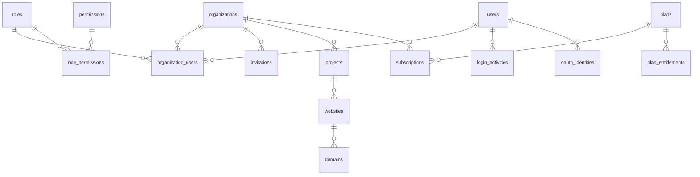

# Database (Phase 1)

PostgreSQL 16. UUIDv7 primary keys (`HasUuids`), timestamps everywhere, soft deletes on user-authored entities
(`organizations, projects, websites, domains`). Migrations in `apps/api/database/migrations`.



| Table | Notes |
|---|---|
| `users` | lower-cased unique email; `two_factor_secret` + `two_factor_recovery_codes` **encrypted** (recovery codes stored as sha256); `password` bcrypt |
| `sessions`, `password_reset_tokens` | Laravel database sessions (used for device management) |
| `login_activities` | every sign-in outcome; IP stored per `PRIVACY_IP_MODE` (`truncated` default, `hashed`, `full`) |
| `roles`, `permissions`, `role_permissions` | system data synced from `RoleCatalog` by migration / `php artisan mios:sync-catalogs` |
| `organizations`, `organization_users` | unique `(organization_id, user_id)`; one role per member |
| `invitations` | `token_hash` (sha256) — the emailed token is never stored; expiry, accept/revoke timestamps |
| `projects`, `websites`, `domains` | tenant tables, **RLS forced**. Unique live `(organization_id, host)` on `domains` (partial index `WHERE deleted_at IS NULL`) |
| `audit_logs` | append-only (RLS: no UPDATE/DELETE policy + trigger). No FKs so the trail outlives its subjects. `metadata` is redacted before insert |
| `plans`, `plan_entitlements`, `subscriptions` | plans are data synced from `config/plans.php`; limits: `projects.max`, `websites.per_project.max`, `members.max` |
| `oauth_identities` | schema only (social login is not wired) |

## Row-level security

```sql
CREATE FUNCTION app_current_org() RETURNS uuid ...   -- reads current_setting('app.current_org', true)
ALTER TABLE projects ENABLE ROW LEVEL SECURITY;
ALTER TABLE projects FORCE  ROW LEVEL SECURITY;       -- applies to the table owner too
CREATE POLICY tenant_isolation ON projects USING (organization_id = app_current_org())
                                           WITH CHECK (organization_id = app_current_org());
```

* No context ⇒ no rows. The application role must **not** be a superuser or have `BYPASSRLS`.
* Migrations run as the owner; adding a tenant table means calling `TenantRls::enable($table)` (the architecture
  test fails otherwise).
* `audit_logs`: SELECT allowed for `organization_id = app_current_org() OR organization_id IS NULL`
  (sign-in events have no org); INSERT allowed from any context; no UPDATE/DELETE policy.

## Advisory locks

Counted limits (`projects.max`, domain uniqueness, last-owner checks) run inside a transaction holding
`pg_advisory_xact_lock(hashtext('<scope>:<org id>'))` so concurrent requests cannot exceed a limit.

## Conventions for new tables

`uuid` PK · `organization_id` FK + index leading composite indexes · `TenantRls::enable()` · soft deletes only when a
user can "delete" it · money as bigint minor units + currency · JSONB only for provider-specific overflow ·
fact tables (Phase 2+) partitioned by month with `sync_run_id` for lineage.
